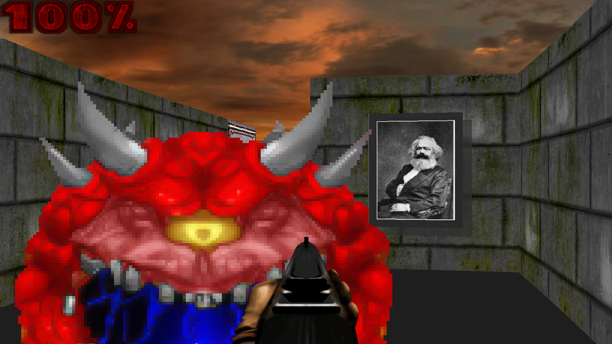
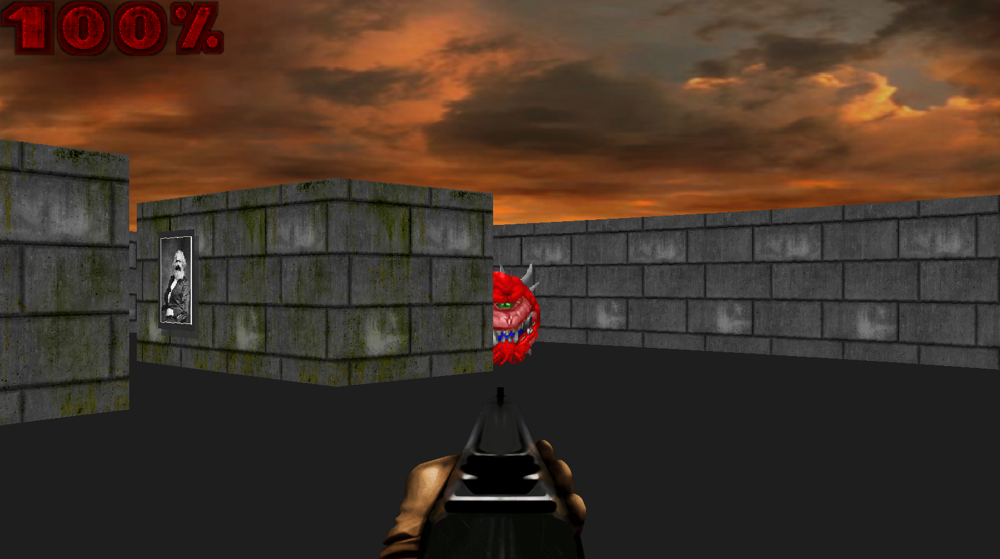
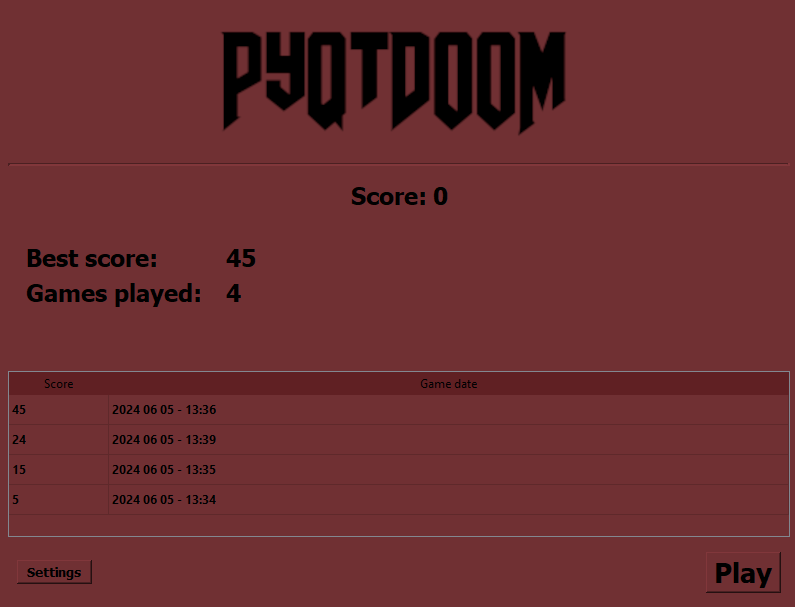
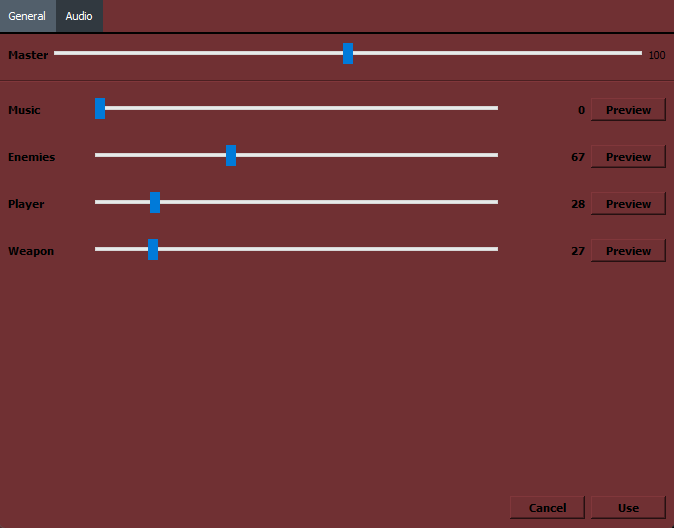
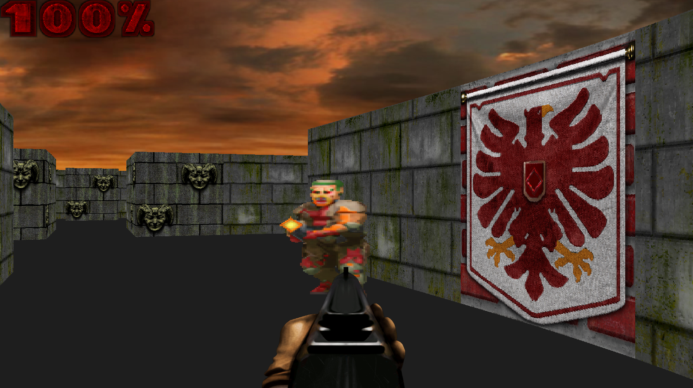

Fork of [this repository](https://github.com/StanislavPetrovV/DOOM-style-Game). Score has been added to the game logic. Alternative textures and sounds can be activated in newly added settings. 

<h2>Installation</h2>

<h3>Clone repository</h3>

Might work with variety of Python version as long as the package versions specified in `requirements.txt` are available for your Python version.

```
$ git clone https://github.com/1000101cz/PyQt_DOOM
$ cd PyQt_DOOM
$ pip install -r requirements.txt  # Install python requirements
$ python main.py  # start the application
```

<h3>Install using pip</h3>

Installation using pip requires Python 3.11+

```
$ pip install git+https://github.com/1000101cz/PyQt_DOOM.git 
$ python
Python 3.11.9 (main, Apr 19 2024, 16:48:06) [GCC 11.2.0] on linux
Type "help", "copyright", "credits" or "license" for more information.

>>> import PyQt_DOOM
>>> PyQt_DOOM.start()
```

<h2>Screenshots</h2>









